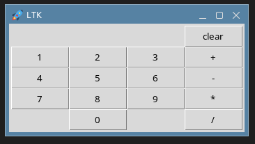
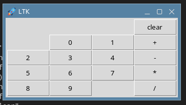

## <center> Национальный исследовательский университет информационных технологий, механики и оптики </center> 
### <center> Факультет Программной Инженерии и Компьютерной Техники </center> 
----
 <br /> 
 <br />
 <br />

## <center> Лабораторная работа 4 </center>

### <center>Вариант "Calculator with macros"</center>

### <center>«Функциональное программирование»</center>

<div style="text-align: right"> 

Работу выполнила:

Студентки группы P34102

Сенина Мария
и
Конаныхина Антонина

Преподаватель:

Пенской Александр Владимирович
</div>


<center>Санкт-Петербург</center>
<center>2024</center>

<div style="page-break-after: always; visibility: hidden">pagebreak</div>

# Цель
Получить навыки работы со специфичными для выбранной технологии/языка программирования приёмами.

# Требования:
* Программа должна быть реализована в функциональном стиле;
* Требуется использовать идиоматичный для технологии стиль программирования;
* Задание и коллектив должны быть согласованы;
* Допустима совместная работа над одним заданием.

## Содержание отчёта:
* титульный лист;
* требования к разработанному ПО, включая описание алгоритма;
* реализация с минимальными комментариями;
* ввод/вывод программы;
* выводы (отзыв об использованных приёмах программирования).

# Реализация 
Мы решили, что чтобы полностью прочуствовать язык common lisp мы должны попробовать использовать его мощную систему препроцессорной обработки.
Поэтому проект, который мы выбрали в качестве задания на 4ю лабораторную работу заключался в том, чтобы реализовывать калькулятор с использованием библиотеки [LTK Lisp](http://www.peter-herth.de/ltk/ltkdoc/node1.html), а потом отрефакторить полученный код, пользуясь макросами.

## Библиотека ltk lisp
Сама по себе библиотека состоит из двух частей:
* Библиотеки Tk - это графический инструментарий для языка программирования tcl, разработанный Джоном Оустерхаутом.
* Библиотеки LTK - адаптирующей TK для common lisp

### Установка
Чтобы поставить библиотеку пришлось повозиться. Я расскажу об установке на Astra Linux

```apt install tcl tk```

Далее в компилятор sbcl нужно было установить `quicklisp`

Первая установка

```
curl -O https://beta.quicklisp.org/quicklisp.lisp
curl -O https://beta.quicklisp.org/quicklisp.lisp.asc
sbcl --load quicklisp.lisp
* (quicklisp-quickstart:install)
```

Последующая загрузка

```
sbcl
* (load "~/quicklisp/setup.lisp")
```

Далее можно проверить работоспособность библиотеки запустив вот такой код:

```cl
(ql:quickload :ltk)
(ql:quickload :asdf)
(in-package :ltk-user)
(ltktest)
```

# Реализация калькулятора первой версиии

[Вот в этом файле](src/old-calc.lisp) вы можете посмотреть код до рефакторинга.



# Рефакторинг

А благодаря вот этим макросам код стал заметно короче, ушли ненужные повторы.

```cl
(defmacro number-buttons(f cur-num oper first-num label)
  `(progn ,(loop :for num from -1 to 10
                 :collect  (if (equal num -1)
                               `progn
                             `(set (intern ,(format nil "b~a" num))
                                   (make-instance 'button
						  :master ,f
						  :text ,(format nil "~a" num)
						  :command (lambda () (progn (setf ,cur-num (add_number ,num ,cur-num ,oper ,first-num ,label))
									     (format t "~a~&", num)))))))
          (progn ,@(let ((num 0))
		     (loop :for i from 1 to 5
			   :append (loop :for j from 1 to 3
					 :until (equal num 10)
					 :collect `(grid (symbol-value (intern ,(format nil "b~a" num))) ,i ,j :sticky :e)
					 :do (setf num (+ num 1))))))))
```

```cl
(defmacro operation-buttons(f first-num cur-num oper)
  (let ((opers (list (cons #'+ "+")
                     (cons #'- "-")
                     (cons #'* "*")
                     (cons #'/ "/")))
        (num 0))
    `(progn ,@(mapcar (lambda (o)
			(progn
                          (setf num (+ num 1))
                          `(progn
                             (set (intern ,(format nil "b~a" (cdr o)))
                                  (make-instance 'button
                                                 :master ,f
                                                 :text ,(cdr o)
                                                 :command (lambda () (progn (setf ,oper ,(car o))
									    (setf ,first-num ,cur-num)
									    (setf ,cur-num 0)
									    (format t "~a~&" ,(cdr o))))))
                             (grid (symbol-value (intern ,(format nil "b~a" (cdr o)))) ,num 4  :sticky :e))))
                      opers))))
```

```cl
(defun add_number(num cur-num oper first-num label)
  (let ((new-cur (+ (* cur-num 10) num)))
    (handler-case
	(when (not (null oper))
          (setf (text label) (format nil "~f~%" (funcall oper first-num new-cur))))
      (division-by-zero () (setf (text label) "devidion by zero")))
    new-cur))

(defun main()
  (with-ltk ()
	    (let* ((first-num 0)
		   (cur-num 0)
		   (oper nil)
		   (f (make-instance 'frame))
		   (label (make-instance 'label
					 :master f
					 :text ""))
		   (clear (make-instance 'button
					 :master f
					 :text "clear"
					 :command (lambda () (progn (setf first-num 0)
								    (setf cur-num 0)
								    (setf oper nil)
								    (setf (text label) "")
								    (format t "clear~&"))))))
              (grid f 0 0
                    :sticky :n
                    :padx 3
                    :pady 3
                    :rowspan 3)
              (grid label 0 1)
              (grid clear 0 4)
              (operation-buttons f first-num cur-num oper)
              (number-buttons f cur-num oper first-num label))))
```



Новый вид калькулятора

# Заключение
В этой лаборатоной работе мы познакомились с кроличьей норой по имени макросы comman lisp. Эта тема понстоящему безднная, зато очень интересная. Так же мы попробовали писать пользовательские графические интерфейсы на новом языке. На наш взгляд язык не очень для этого преспособлен, но это вероятно от недстатка нашей практики.